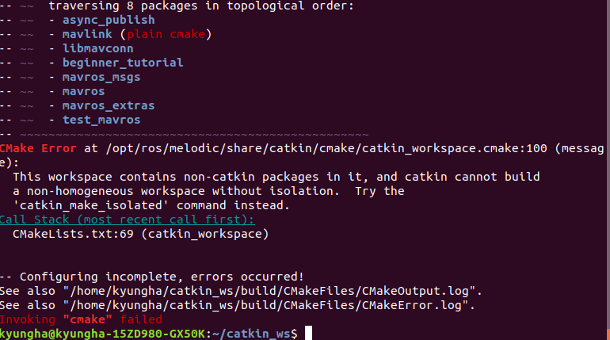
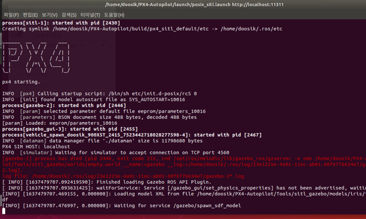
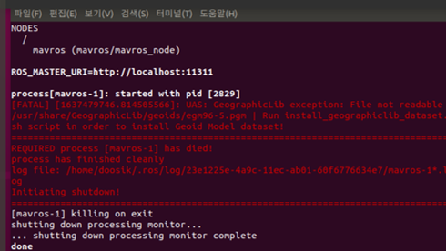
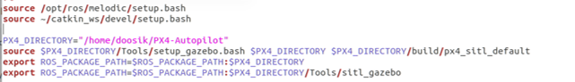
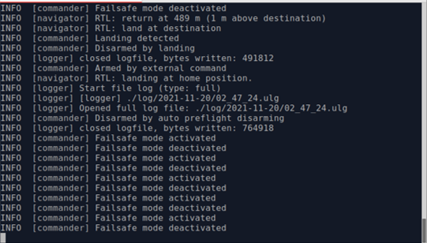
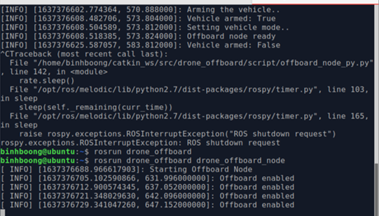

# Q&A

## 1. `catkin_make` error



As the error message says, this error is cause because CmakeLists.txt of some package, mavlink in this case, is not written in with catkin. I understand here we tried to install dependencies with source build. Choose one of the two options. First one is prefered if you are not going to make changes directly to the packages including `mavros`.

1. Remove source build and install with package managers.

```bash
cd ~/catkin_ws/src
rm -rf mavlink libmavconn mavros_msgs mavros mavros_extras test_mavros # remove source code
cd ../
rm -rf build/ devel/ # remove built objects and setups for packages installed with apt to take effect
sudo apt-get update
sudo apt-get install ros-melodic-mavros*
catkin_make
```

2. Build using `catkin_make_isolated`

```bash
rm -rf build/ devel/ # remove built objects and setups for catkin_make_isolated command to complete the build
catkin_make_isolated
```
> [_Explaining `catkin_make` vs `catkin_make_isolated`_](https://answers.ros.org/question/320613/catkin_make-vs-catkin_make_isolated-which-is-preferred/?answer=320614#post-id-320614)

## 2. Gazebo Shutdown / Not Being Launched


When running `roslaunch px4 posix_sitl.launch` while previous Gazebo session was not shut down properly, it may affect launching the new session.
```bash
killall gzserver gzclient
```
Issue the above command and relaunch `Gazebo`.

## 3. UAS: GeographicLib exception

When running `roslaunch mavros px4.launch`, the error message in the picture may appear. As the message suggests, first check if the file `egm96-5.pgm` actually exists in the path. Else, find the file and copy it to the path where the error message complains. Below is an example.
```bash
$ sudo find / -name egm96-5.pgm # search for the file named egm96-5.pgm for all of your storage
/usr/local/share/GeographicLib/geoids/egm96-5.pgm
$ sudo cp /usr/local/share/GeographicLib/geoids/egm96-5.pgm /usr/share/GeographicLib/geoids/
```

## 4. Unable to find packages / Settings for `.bashrc`

In your `.bashrc`, you need to _always_ have the above lines.(Or else, you need to type those lines every time you open a new terminal)
- `source /opt/ros/melodic/setup.bash` lets you find packages installed with the package manager from the terminal.
- `source ~/catkin_ws/devel/setup.bash` lets you find packages built from source in your `catkin_ws`.
    > If you make an workspace other than the `catkin_ws`, source that setup file using `source <the_other_ws>/devel/setup.bash`

If you cannot find your package, run `rospack profile`. This command searches your files system for ROS packages.

## 5. E: Unable to locate `kconfig-frontends`
When installing `PX4-Autopilot` dependcies with `PX4-Autopilot/Tools/setup/ubuntu.sh`, it may show 'E: Unable to locate `kconfig-frontends`'. This is because the latest `nuttx`(FC(Flight Controller) OS) dependencies are not well organized in the Ubuntu apt repository. We need to add `no-nuttx` option as follows.
```bash
cd <PX4-Autopilot>
./Tools/setup/ubuntu.sh --no-nuttx
```
Reboot and proceed to `make px4_sitl gazebo`.

## 6. Vehicle Not Arming/Takingoff
Using the offboard code from the [EE478 class repository](https://github.com/swl017/EE478/tree/main/ros_code/drone_offboard), there can be numerous reasons for this.

1. Try the node built with C++ code. The Python script may not make the drone takeoff at once.
    > `rosrun drone_offboard drone_offboard_node`
    
    After a minute or so, the drone should arm and takeoff. If it doesn't, try the second option.

2. If your drone keeps trying to enter offboard mode but fails like the image below, downgrade the `PX4-Autopilot` release into `1.12`.
    `roslaunch px4 posix_sitl.launch`
    

    `rosrun drone_offboard drone_offboard_node`
    

    Change release versions with the following command.
    > ```bash
    > git clone https://github.com/PX4/PX4-Autopilot.git
    > cd PX4-Autopilot
    > git checkout release/1.12
    Reboot and proceed to `make px4_sitl gazebo`.
